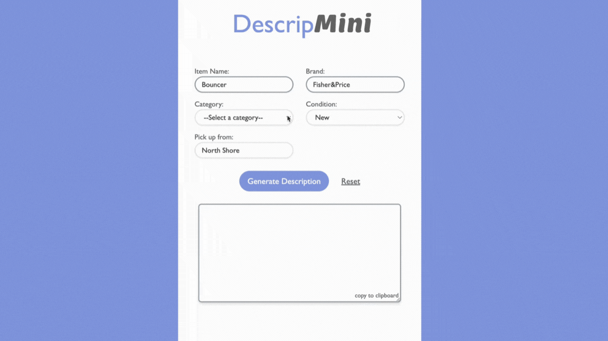

# DescripMini App

DescripMini is a student project I developed during my time at Dev Academy.
As a mother of a 3-year-old, I often sell second-hand baby items and found that writing product descriptions was time-consuming.
This experience inspired DescripMini. It is a basic small web form that connects to the OpenAI API. It
automatically generates a short description for users based on their
form inputs when they want to create second-hand selling listings.

## Technologies

  

## What's next?

I've recently reviewed this project and am planning to explore the feasibility of incorporating image recognition technology. This enhancement would allow users to generate brief descriptions based directly on the images they upload, further simplifying the process of creating listings for second-hand items.
